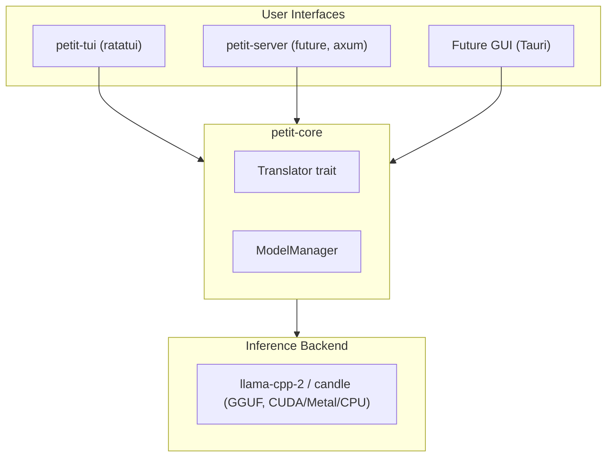

# petit_trad — Architecture

## Overview

**petit_trad** is a cross-platform translation tool powered by
Google's TranslateGemma model (released January 2026).
TranslateGemma is a family of dedicated translation models available in 4B,
12B, and 27B parameter sizes.
The tool runs inference locally without relying on cloud APIs
or serving frameworks like Ollama.

---

## Technology Stack

### Language: Rust

Chosen over C++ for:

- **Memory safety** without runtime overhead
- **Cargo** — superior cross-platform build system vs CMake complexity
- **Ecosystem** — `ratatui` (17.5k stars) is the de facto TUI standard;
  `llama-cpp-2` provides battle-tested llama.cpp bindings
- **Future-proof** — Tauri enables native GUI with web frontend sharing the same Rust core

### Inference: llama-cpp-2

Rust bindings to llama.cpp:

- Supports GGUF quantized models
- Backends: CUDA, Metal, Vulkan, CPU (AVX/NEON)
- Alternative: `candle` (pure Rust, Hugging Face) for scenarios avoiding FFI

### Model Selection: TranslateGemma

| Model   | FP16 VRAM | Q4_K_M VRAM | Use Case                             |
| ------- | --------- | ----------- | ------------------------------------ |
| **4B**  | ~8GB      | ~2.5GB      | Fast inference, lower quality        |
| **12B** | ~24GB     | ~7GB        | **Default** — balanced quality/speed |
| **27B** | ~54GB     | ~16GB       | Best quality, high VRAM              |

- **Windows/WSL (16GB VRAM):** 12B recommended (comfortable fit with context)
- **macOS (64GB unified):** 27B for best quality

### TUI: ratatui + crossterm

- Cross-platform terminal rendering (WSL, Linux, macOS, Windows)
- Immediate-mode functional API
- Rich widget library (text areas, lists, tabs)

### Prototyping: Python + transformers

- Validate TranslateGemma prompt format and behavior before Rust implementation
- Quick iteration on translation quality experiments
- Use `uv` to manage python environment (use the correct version) and run code
- Use `ruff` and `ty` to format and check Python code

---

## Project Structure

```
petit_trad/
├── AGENTS.md                  # Agent operating rules and doc map
├── ARCHITECTURE.md            # Top-level architecture overview
├── Cargo.toml                 # Workspace manifest
├── crates/
│   ├── petit-core/            # Translation engine library boundary
│   └── petit-tui/             # Terminal frontend boundary
├── docs/                      # Durable project documentation
│   ├── BUILD.md               # Build and local dev setup
│   ├── PLANS.md               # ExecPlan standard and requirements
│   ├── design-docs/           # Technical design and interfaces
│   ├── product-specs/         # Product behavior and quality targets
│   └── execution-plans/       # Active/completed execution plans
├── proto/                     # Python experiments and prompt checks
└── config/
    └── default.toml           # Baseline runtime configuration
```

---

## Data Flow



---

## Core Interfaces

### Translator Trait

```rust
pub trait Translator {
    fn translate(&self, text: &str, source_lang: &str, target_lang: &str) -> Result<String>;
    fn supported_languages(&self) -> &[&str];
}
```

### Configuration

```rust
pub struct Config {
    pub model_path: PathBuf,    // Path to GGUF model
    pub gpu_layers: u32,        // Layers to offload to GPU (0 = CPU)
    pub context_size: u32,      // Model context window
    pub threads: u32,           // CPU threads for inference
    pub log_to_file: bool,      // Write llama.cpp logs to a file
    pub log_path: PathBuf,      // Log file path (if enabled)
}
```

---

## Platform Support

| Platform              | GPU Backend | Status             |
| --------------------- | ----------- | ------------------ |
| WSL2 (NVIDIA)         | CUDA        | Primary dev target |
| Linux (NVIDIA)        | CUDA        | Supported          |
| Linux (AMD)           | Vulkan/HIP  | Planned            |
| macOS (Apple Silicon) | Metal       | Supported          |
| macOS (Intel)         | CPU         | Supported          |
| Windows (NVIDIA)      | CUDA        | Supported          |
| Windows (AMD)         | Vulkan      | Planned            |

---

## Design Decisions

### Sync vs Async

- `petit-core` provides **synchronous** API for simplicity
- `petit-tui` runs inference in a **separate thread** with loading indicator
- Future `petit-server` will wrap in **async** (tokio)

### Model Format

- Primary: **GGUF** (llama.cpp native format)
- Default model (config): **TranslateGemma 12B Q8_0** (local default)
- Quantization options: Q4_K_M (recommended), Q5_K_M, Q8_0 (higher quality, larger)
- For 16GB VRAM: 12B Q4_K_M or 4B Q8_0
- For 64GB+ VRAM: 27B Q4_K_M or Q5_K_M

### Configuration Precedence

```
CLI args > Environment vars > Config file > Defaults
```

---

## Future Extensions

### GUI Frontend

- **Tauri** recommended: Rust backend + web frontend
- Shares `petit-core` as library dependency
- Cross-platform (Windows, macOS, Linux)

### HTTP Server (petit-server)

- OpenAI-compatible `/v1/completions` endpoint
- Enables integration with other tools
- Built with `axum`
